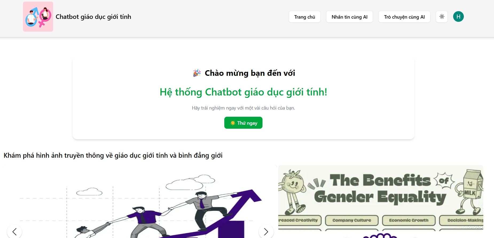
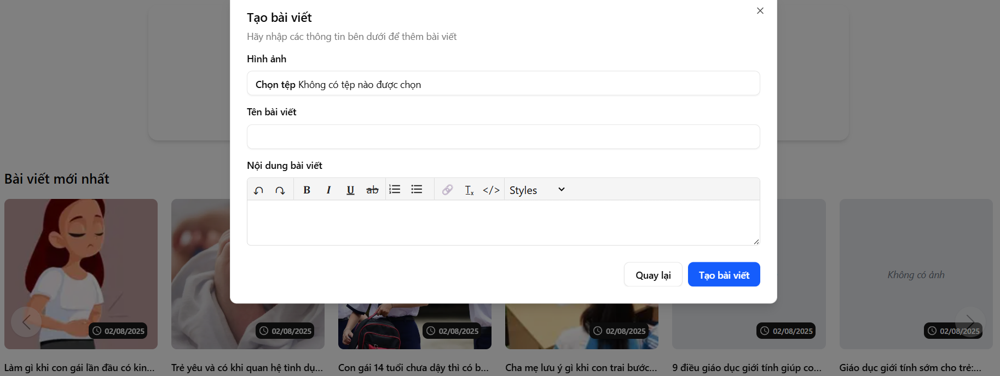
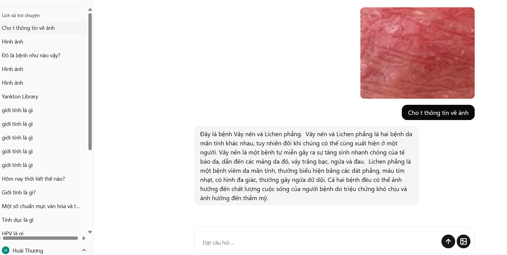
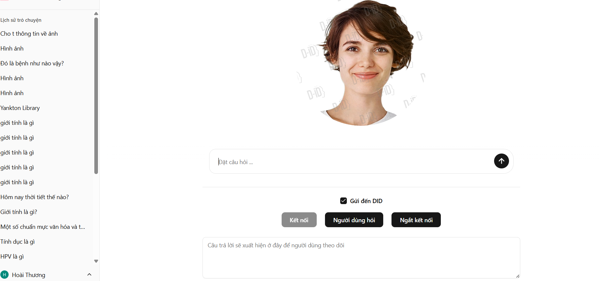

# Sex Education Chatbot (Client)

Sex Education Chatbot is a modern web platform that helps students quickly find accurate answers about sex education.
The application is designed for students from elementary to high school, especially those going through puberty.
Users can ask questions on various important topics such as sex education, sexual activity, puberty changes in male and female bodies, issues like wet dreams and menstruation, and ways to prevent or handle harassment situations.  
It supports a full range of core features including:

-   **OAuth2 Login** – sign-in quickly with Google
-   **Chatbot Q&A** – ask questions and receive instant, accurate answers
-   **Multiple input types** – ask questions via text or images (e.g., skin diseases)
-   **Voice interaction (D-ID)** - ask questions using voice and receive responses with speech and animated robot visuals
-   **Community posts** – students can share thoughts, opinions, or personal experiences
-   **User-friendly interface** – designed for students, easy-to-use, modern UI

This repository contains the frontend codebase built with NextJS and other modern technologies.

Check out: [Sex Education Chatbot (Server)](https://github.com/SoulMinT05/sex-education-chatbot-backend)

## Example Screenshots






## Tech Stack

-   **Framework**: NextJS
-   **UI Library**: shadcn-ui
-   **State Management**: Redux Toolkit
-   **Styling**: TailwindCSS
-   **Utilities**: Axios, JS-Cookies, Firebase

## Getting Started

### Installation

1. Clone the repository:
    ```bash
    git clone https://github.com/SoulMinT05/sex-education-chatbot-frontend
    ```
2. Install dependencies:
    ```bash
    npm install
    # or
    yarn install
    ```
3. Configure environment variables:

    - Copy `.env.example` to `.env`:
        ```bash
        cp .env.example .env
        ```
    - Ensure the following variables are set in `.env`, and adjust them to match your API endpoints and Cloudinary storage configuration:

        ```env
        NEXT_PUBLIC_FRONTEND_URL=
        NEXT_PUBLIC_BACKEND_URL_NODEJS=
        NEXT_PUBLIC_BACKEND_URL_PYTHON=
        NEXT_GOOGLE_GEMINI_KEY=
        NEXT_GOOGLE_D_ID_KEY=
        NEXT_OPENAI_KEY=
        NEXT_PUBLIC_API_KEY=
        NEXT_PUBLIC_AUTH_DOMAIN=
        NEXT_PUBLIC_PROJECT_ID=
        NEXT_PUBLIC_STORAGE_BUCKET=
        NEXT_PUBLIC_MESSAGING_SENDER_ID=
        NEXT_PUBLIC_APP_ID=
        ```

### Development Server

Start the development server with:

```bash
npm run dev
# or
yarn dev
```

The app will be available at `http://localhost:3000` by default.

### Build for Production

To build the project for production:

```bash
npm run build
# or
yarn build
```

The production build files will be in the `dist` folder.

## License

This project is licensed under the MIT License. See the [LICENSE](LICENSE) file for details.
